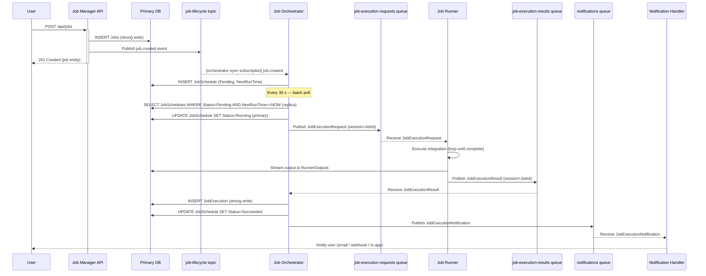

# Batching & Streaming Strategy

**System:** Job Manager / Orchestrator  
**Messaging Infrastructure:** Azure Service Bus  
**Date:** 2026-06-21

---

## 1. Overview

The system spans two primary functional domains:

| Domain | Service | Role |
|---|---|---|
| Job Management | Job Manager | CRUD for job definitions; owns the authoritative `Jobs` table |
| Job Execution | Job Orchestrator | Schedules and coordinates job runs; owns `JobSchedules` |
| Job Execution | Job Runner | Executes individual integrations; writes to `JobExecutions` |
| Notification | Notification Handler | Delivers run-result notifications to users |

Each domain has different throughput, latency, and ordering requirements that drive the choice between real-time stream processing, batch processing, or a hybrid of both.

---

## 2. Messaging Infrastructure

### 2.1 Why Azure Service Bus

Azure Service Bus is the right choice for this system for the following reasons:

| Requirement | Azure Service Bus capability |
|---|---|
| **Reliable delivery** — job execution triggers must not be lost | At-least-once delivery with message lock and dead-letter queue (DLQ) |
| **Ordered execution per job** — a job must not run concurrently with itself | Sessions (session key = `JobId`) guarantee FIFO ordering per job |
| **Fan-out** — a single job-lifecycle event must reach multiple consumers | Topics + subscriptions with server-side message filtering |
| **Competing consumers** — multiple runner instances in parallel | Queue-based competing consumers; each message delivered to exactly one consumer |
| **Delayed/scheduled triggers** — orchestrator enqueues a message for future execution | Scheduled message enqueue time (`ScheduledEnqueueTimeUtc`) |
| **Poison message handling** — failed executions must not block the queue | Dead-letter queue (DLQ) with configurable max-delivery count |
| **Enterprise grade** — existing Azure investment, managed SLA, RBAC integration | Fully managed, 99.9% SLA, Azure AD / Managed Identity auth |

> **Why not Kafka / Event Hubs?** The system's message volume is modest (thousands of messages per day, not millions per second). Apache Kafka and Azure Event Hubs are optimised for high-throughput log-streaming at massive scale. Azure Service Bus is better suited to transactional, workflow-style messaging where guaranteed delivery, sessions, and dead-lettering are more important than raw throughput.

### 2.2 Namespace Layout

```
Azure Service Bus Namespace: sb-jobmanager-<env>
│
├── Topics
│   └── job-lifecycle                    ← job create / update / delete events
│       ├── subscription: orchestrator-sync
│       └── subscription: audit-log
│
└── Queues
    ├── job-execution-requests           ← Orchestrator → Runner  (sessions enabled)
    ├── job-execution-results            ← Runner → Orchestrator  (sessions enabled)
    └── notifications                    ← Orchestrator → Notification Handler
```

### 2.3 Configuration Reference

| Entity | Type | Sessions | Max Delivery | Lock Duration | Partition |
|---|---|---|---|---|---|
| `job-lifecycle` | Topic | No | 10 | 60 s | Enabled (2 partitions) |
| `orchestrator-sync` | Subscription | No | 10 | 60 s | — |
| `audit-log` | Subscription | No | 5 | 30 s | — |
| `job-execution-requests` | Queue | **Yes** (`JobId`) | 5 | **300 s** | Enabled (4 partitions) |
| `job-execution-results` | Queue | **Yes** (`JobId`) | 5 | 60 s | Enabled (4 partitions) |
| `notifications` | Queue | No | 3 | 30 s | Enabled (2 partitions) |

**Sessions on execution queues** (`session key = JobId`): guarantees that all messages for a given job are processed in order by one consumer at a time. This prevents a slow runner from allowing a second runner to start the same job before the first completes, eliminating the need for a separate database-level lock in most cases.

**Long lock duration on `job-execution-requests` (300 s):** job integrations may take minutes to complete; the runner must hold the message lock until the job finishes or it must call `RenewMessageLockAsync` periodically.

**Partitioning:** enabled on all entities to improve throughput and resilience; the partition key for queues is the session key (`JobId`).

---

## 3. Use Case Processing Strategies

---

### UC1.1 — Job Creation (`POST /api/jobs`)

#### Processing Type: **Hybrid** (synchronous write + asynchronous event)

**Justification:**  
The HTTP request must complete synchronously — the user expects an immediate `201 Created` response with the created entity. However, downstream consumers (the Orchestrator, the audit log) do not need to be updated within the same synchronous transaction. Coupling the HTTP response to downstream propagation would increase latency and introduce failure modes that are not the user's concern.

The write to the primary database is synchronous (strong consistency, per Consistency-Requirements-Analysis.md). After the write commits, a `job.created` event is published to the `job-lifecycle` topic asynchronously.

#### Event Published

**Topic:** `job-lifecycle`  
**Event type:** `job.created`

```json
{
  "eventType": "job.created",
  "eventId": "<uuid>",
  "occurredAt": "2026-06-21T08:00:00Z",
  "correlationId": "<request-correlation-id>",
  "payload": {
    "jobId": "<uuid>",
    "name": "Daily Report",
    "frequency": "Daily",
    "executionTime": "08:00:00",
    "apiEndpoint": "https://partner.example.com/api/report",
    "createdAt": "2026-06-21T08:00:00Z"
  }
}
```

**Message properties:**
- `Subject` = `job.created`
- `MessageId` = `job.created.<jobId>` (idempotency key)
- `CorrelationId` = HTTP request correlation ID

#### Consumer Services

| Consumer | Subscription | Action |
|---|---|---|
| **Job Orchestrator** | `orchestrator-sync` | Creates the initial `JobSchedule` row (Pending) and computes `NextRunTime` based on `Frequency` + `ExecutionTime` |
| **Audit Log Service** | `audit-log` | Records the creation event for compliance/history |

#### Batch Considerations

No batch trigger applies. The event is published immediately after the write commits. If the Service Bus publish fails (transient network error), the application retries with exponential back-off. If retries are exhausted, the job exists in the database but the Orchestrator has not received the sync event — the Orchestrator's periodic reconciliation batch (see UC2.1) detects orphan jobs with no schedule and self-heals.

---

### UC1.2 — Job Update (`PUT /api/jobs/{id}`)

#### Processing Type: **Hybrid** (synchronous write + asynchronous event)

**Justification:**  
Same rationale as UC1.1. The HTTP response is synchronous. The Orchestrator needs to know about configuration changes (e.g., a new `ApiEndpoint` or changed `Frequency`) but can tolerate a brief delay, because schedule resolution happens at trigger time, not at update time.

#### Event Published

**Topic:** `job-lifecycle`  
**Event type:** `job.updated`

```json
{
  "eventType": "job.updated",
  "eventId": "<uuid>",
  "occurredAt": "2026-06-21T09:15:00Z",
  "correlationId": "<request-correlation-id>",
  "payload": {
    "jobId": "<uuid>",
    "name": "Daily Report — Updated",
    "frequency": "Hourly",
    "executionTime": "00:30:00",
    "apiEndpoint": "https://partner.example.com/api/report-v2",
    "updatedAt": "2026-06-21T09:15:00Z"
  }
}
```

**Message properties:**
- `Subject` = `job.updated`
- `MessageId` = `job.updated.<jobId>.<updatedAt-ticks>` (idempotency key; latest update wins)

#### Consumer Services

| Consumer | Subscription | Action |
|---|---|---|
| **Job Orchestrator** | `orchestrator-sync` | Reschedules the job's next `JobSchedule`: cancels any `Pending` schedule for this job and creates a new one based on the updated `Frequency` + `ExecutionTime` |
| **Audit Log Service** | `audit-log` | Records the change with before/after field delta |

---

### UC1.3 — Job Deletion (`DELETE /api/jobs/{id}`)

#### Processing Type: **Hybrid** (synchronous write + asynchronous event)

**Justification:**  
The HTTP delete is synchronous (cascade-deletes `JobSchedules` and `JobExecutions` on the primary). The Orchestrator must be informed so it stops polling for and triggering this job. Because the database cascade already removes the `JobSchedule` rows, the Orchestrator's next poll will naturally not find the job — however an explicit event allows the Orchestrator to cancel any in-flight execution message it may have already enqueued on `job-execution-requests`.

#### Event Published

**Topic:** `job-lifecycle`  
**Event type:** `job.deleted`

```json
{
  "eventType": "job.deleted",
  "eventId": "<uuid>",
  "occurredAt": "2026-06-21T10:00:00Z",
  "correlationId": "<request-correlation-id>",
  "payload": {
    "jobId": "<uuid>",
    "deletedAt": "2026-06-21T10:00:00Z"
  }
}
```

**Message properties:**
- `Subject` = `job.deleted`
- `MessageId` = `job.deleted.<jobId>`

#### Consumer Services

| Consumer | Subscription | Action |
|---|---|---|
| **Job Orchestrator** | `orchestrator-sync` | Marks any in-flight execution for this `jobId` as cancelled; ignores future `job-execution-results` messages for this `jobId` |
| **Audit Log Service** | `audit-log` | Records the deletion with the full job snapshot for archival |

---

### UC2.1 — Job Orchestration: Schedule Polling + Execution

This use case spans two distinct processing phases with different characteristics.

#### Phase A — Schedule Polling (Batch)

#### Processing Type: **Batch**

**Justification:**  
Jobs are defined with coarse-grained frequencies (Hourly, Daily, Weekly, Monthly). There is no business requirement to trigger a job within milliseconds of its scheduled time — a few seconds of jitter is imperceptible relative to the scheduling granularity. Polling on a fixed interval is simpler, more predictable, and avoids the overhead of a continuous event stream where the event rate is very low (thousands of schedules per day, not millions per second).

**Batch trigger:** Internal timer in the Job Orchestrator service.  
**Polling interval:** configurable, default **30 seconds**.

**Batch processing flow:**

```
Every 30 s:
  1. Query replica: SELECT * FROM JobSchedules
                    WHERE Status = 'Pending'
                      AND NextRunTime <= GETUTCDATE()
                    (Eventual consistency — UC2.1a)

  2. Split results into parallel execution batches
     (e.g., max 50 jobs per batch, fanned out concurrently)

  3. For each job in batch:
     a. Attempt session-based message send to `job-execution-requests`
        (session key = JobId; ScheduledEnqueueTimeUtc = now)
     b. Update JobSchedule.Status = 'Running' on primary
     c. Compute and insert next JobSchedule (Status = 'Pending') for the next interval
```

**Why not update the schedule status before enqueuing?**  
The status update and message publish are not in a distributed transaction. The recommended pattern is: enqueue first (idempotent message ID prevents duplicates), then update status. If the status update fails, the Runner will still execute and report back, and the Orchestrator's result handler updates the status. The next poll cycle will not pick up a `Running` schedule.

**Self-healing reconciliation (daily batch):**  
A separate, lower-frequency batch (every 15 minutes) queries for `JobSchedule` rows stuck in `Running` status beyond a configurable timeout (default 1 hour). These are considered orphaned executions (the Runner crashed, the message was dead-lettered). The batch resets them to `Pending` for re-execution and raises an alert.

---

#### Phase B — Job Execution (Stream / Event-Driven)

#### Processing Type: **Real-Time Stream (event-driven)**

**Justification:**  
Once the Orchestrator has decided a job should run, the execution itself is latency-sensitive from an operational correctness perspective: the job must not run twice simultaneously, the result must be captured promptly, and the user must be notified when the run completes. This is naturally event-driven — the Orchestrator publishes a command, the Runner acts on it, the Runner publishes a result, the Orchestrator and Notification Handler react.

#### Message: `JobExecutionRequest`

**Queue:** `job-execution-requests`  
**Published by:** Job Orchestrator  
**Consumed by:** Job Runner

```json
{
  "messageId": "exec-req-<jobId>-<scheduleId>",
  "sessionId": "<jobId>",
  "payload": {
    "jobId": "<uuid>",
    "scheduleId": "<uuid>",
    "jobName": "Daily Report",
    "apiEndpoint": "https://partner.example.com/api/report-v2",
    "scheduledAt": "2026-06-21T08:00:00Z",
    "triggeredAt": "2026-06-21T08:00:02Z"
  }
}
```

**Purpose:** Commands the Job Runner to execute the specific integration call. The `scheduleId` allows the Runner to report back unambiguously. The `apiEndpoint` is included directly so the Runner does not need to re-query the database (avoids stale-read risk at execution time).

---

#### Message: `JobExecutionResult`

**Queue:** `job-execution-results`  
**Published by:** Job Runner  
**Consumed by:** Job Orchestrator

```json
{
  "messageId": "exec-result-<jobId>-<scheduleId>",
  "sessionId": "<jobId>",
  "payload": {
    "jobId": "<uuid>",
    "scheduleId": "<uuid>",
    "status": "Succeeded",
    "startedAt": "2026-06-21T08:00:05Z",
    "completedAt": "2026-06-21T08:00:47Z",
    "durationMs": 42000,
    "httpStatusCode": 200,
    "errorMessage": null,
    "retryCount": 0
  }
}
```

**Purpose:** Reports the outcome of the execution back to the Orchestrator. The Orchestrator uses this to: (a) insert a `JobExecution` row on the primary (strong write), (b) update the `JobSchedule.Status` to `Succeeded` or `Failed`, and (c) publish a notification.

---

#### Message: `JobExecutionFailureNotification` (Orchestrator lock failure path)

**Queue:** `notifications`  
**Published by:** Job Orchestrator (on session lock failure)  
**Consumed by:** Notification Handler

```json
{
  "messageId": "notif-<uuid>",
  "payload": {
    "jobId": "<uuid>",
    "jobName": "Daily Report",
    "eventType": "ExecutionLockFailed",
    "occurredAt": "2026-06-21T08:00:03Z",
    "reason": "Session already locked by another consumer"
  }
}
```

---

#### Message: `JobExecutionNotification`

**Queue:** `notifications`  
**Published by:** Job Orchestrator (after receiving `JobExecutionResult`)  
**Consumed by:** Notification Handler

```json
{
  "messageId": "notif-<uuid>",
  "payload": {
    "jobId": "<uuid>",
    "jobName": "Daily Report",
    "eventType": "ExecutionCompleted",
    "status": "Succeeded",
    "startedAt": "2026-06-21T08:00:05Z",
    "completedAt": "2026-06-21T08:00:47Z",
    "errorMessage": null
  }
}
```

**Purpose:** Decouples the user-facing notification delivery (email, webhook, in-app) from the execution coordination logic. The Notification Handler is responsible for channel selection, templating, and retry.

---

#### Consumer Services Summary for UC2.1

| Service | Queue / Subscription | Trigger | Responsibility |
|---|---|---|---|
| **Job Orchestrator** (batch poll) | — | Internal timer (30 s) | Polls replica for pending schedules; publishes `JobExecutionRequest` per job |
| **Job Runner** | `job-execution-requests` | Message arrival (session consumer) | Executes the API integration; streams output to `RunnerOutputs` DB; publishes `JobExecutionResult` |
| **Job Orchestrator** (result handler) | `job-execution-results` | Message arrival (session consumer) | Writes `JobExecution` to primary; updates `JobSchedule.Status`; publishes `JobExecutionNotification` |
| **Notification Handler** | `notifications` | Message arrival (competing consumer) | Delivers run-result alerts to users via email / webhook / in-app channel |

---

### UC2.2 — Execution History (`GET /api/jobs/{id}/executions`)

#### Processing Type: **Batch (on-demand read)**

**Justification:**  
Execution history is a monitoring and audit view. Users query it manually and accept eventual consistency (see Consistency-Requirements-Analysis.md UC2.2). There is no event to process here — the data is already written to the `JobExecutions` table by the Orchestrator's result handler (UC2.1).

No messaging is required for this use case. The read path queries the replica directly.

**Optional enhancement — real-time dashboard push:**  
If a future requirement demands a live execution feed (e.g., a WebSocket dashboard), the Orchestrator's result handler can additionally publish the `JobExecutionResult` payload to an Azure SignalR Service hub or to an Azure Event Grid topic for fan-out to connected clients. This remains an additive, non-breaking extension; the core processing strategy is batch on-demand.

---

### UC2.3 — Job Catalog Browsing (`GET /api/jobs`, `GET /api/jobs/{id}`)

#### Processing Type: **None (passive read)**

**Justification:**  
Job catalog browsing is a read-only operation on slowly changing configuration data. No processing, batching, or streaming is required. The replica serves these queries directly. Cache invalidation (if a CDN or in-process cache is added) can be driven by the `job.updated` / `job.deleted` events already published on the `job-lifecycle` topic — no additional infrastructure is needed.

---

## 4. End-to-End Message Flow Diagram



---

## 5. Summary Table

| Use Case | Processing Type | Trigger / Frequency | Key Events / Messages | Infrastructure |
|---|---|---|---|---|
| **UC1.1** Job Creation | Hybrid | Per HTTP request (synchronous write + async event) | `job.created` → `job-lifecycle` topic | `job-lifecycle` topic; `orchestrator-sync` subscription |
| **UC1.2** Job Update | Hybrid | Per HTTP request | `job.updated` → `job-lifecycle` topic | `job-lifecycle` topic; `orchestrator-sync` subscription |
| **UC1.3** Job Deletion | Hybrid | Per HTTP request | `job.deleted` → `job-lifecycle` topic | `job-lifecycle` topic; `orchestrator-sync` subscription |
| **UC2.1a** Schedule Polling | Batch | Internal timer — every 30 s | No message produced; DB query only | Replica DB |
| **UC2.1b** Job Execution (dispatch) | Real-time stream | Pending schedules found in batch poll | `JobExecutionRequest` → `job-execution-requests` queue | `job-execution-requests` queue (sessions) |
| **UC2.1b** Job Execution (result) | Real-time stream | `JobExecutionResult` message received | `JobExecutionResult` → `job-execution-results` queue; `JobExecutionNotification` → `notifications` queue | `job-execution-results` queue; `notifications` queue |
| **UC2.2** Execution History | Batch (on-demand) | User HTTP request | None | Replica DB read |
| **UC2.3** Catalog Browsing | Passive read | User HTTP request | None | Replica DB read |

---

## 6. Idempotency and Error Handling

### 6.1 Idempotent Message Processing

All consumers must be idempotent. Azure Service Bus guarantees **at-least-once delivery** — a message may be delivered more than once if the consumer crashes before completing. Idempotency strategies per queue:

| Queue / Topic | Idempotency Strategy |
|---|---|
| `job-lifecycle` | Use `MessageId` (`job.created.<jobId>`) to detect and skip duplicates via an idempotency table on the primary |
| `job-execution-requests` | `JobSchedule.Status` acts as the idempotency gate: if Status is already `Running` or `Succeeded`, skip re-execution |
| `job-execution-results` | `JobExecution` insert uses `(JobId, ScheduleId)` unique constraint — duplicate inserts are silently ignored |
| `notifications` | Notification service tracks sent notification IDs; duplicate sends are suppressed |

### 6.2 Dead-Letter Queue (DLQ) Handling

Each queue and subscription has a DLQ. Messages exceeding `MaxDeliveryCount` are moved to the DLQ automatically. A dedicated **DLQ Monitor** (background service or Azure Function) reads DLQ messages, logs them to the audit store, and raises an alert. For `job-execution-requests` DLQ entries, the job's `JobSchedule.Status` is reset to `Pending` for the next scheduled reconciliation batch.

### 6.3 Outbox Pattern for Topic Publishing

To guarantee that `job-lifecycle` events are published even if the Service Bus is temporarily unavailable, the Job Manager should use the **Transactional Outbox Pattern**:

1. Within the same database transaction that writes the `Jobs` row, insert a row into an `OutboxMessages` table.
2. A background poller reads unpublished `OutboxMessages` and publishes them to Service Bus.
3. On successful publish, mark the row as published.

This ensures no event is lost if the application crashes between the DB write and the Service Bus publish.
