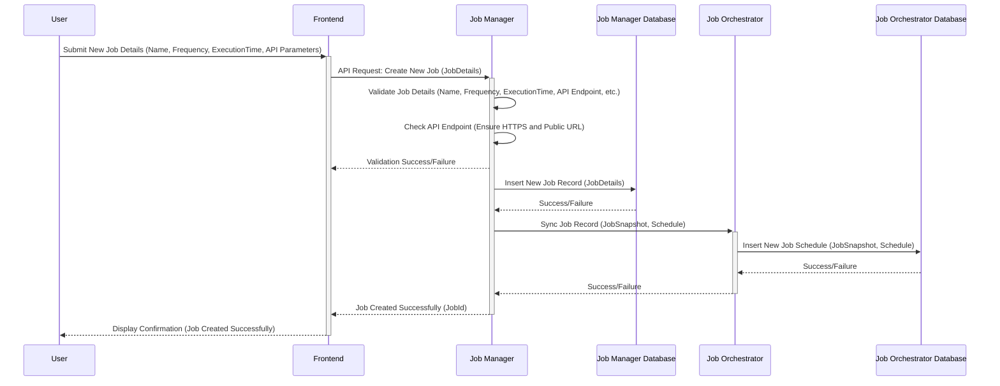

### Conceptual Sequence Diagram for UC1.1

```mermaid
sequenceDiagram
    participant User as User
    participant WebApp as Frontend
    participant Manager as Job Manager
    participant ManagerDatabase as Job Manager Database
    participant Orchestrator as Job Orchestrator
    participant OrchestratorDatabase as Job Orchestrator Database

    %% User initiates job creation
    User->>+WebApp: Submit New Job Details (Name, Frequency, ExecutionTime, API Parameters)
    WebApp->>+Manager: API Request: Create New Job (JobDetails)

    %% Job Manager validates the input
    Manager->>Manager: Validate Job Details (Name, Frequency, ExecutionTime, API Endpoint, etc.)
    Manager->>Manager: Check API Endpoint (Ensure HTTPS and Public URL)
    Manager-->>WebApp: Validation Success/Failure

    %% Job Manager stores the job in the database
    Manager->>ManagerDatabase: Insert New Job Record (JobDetails)
    ManagerDatabase-->>Manager: Success/Failure

    %% Job Manager syncs the job with Job Orchestrator
    Manager->>+Orchestrator: Sync Job Record (JobSnapshot, Schedule)
    Orchestrator->>OrchestratorDatabase: Insert New Job Schedule (JobSnapshot, Schedule)
    OrchestratorDatabase-->>Orchestrator: Success/Failure
    Orchestrator-->>-Manager: Success/Failure

    %% Job Manager confirms job creation
    Manager-->>-WebApp: Job Created Successfully (JobId)
    WebApp-->>-User: Display Confirmation (Job Created Successfully)
```