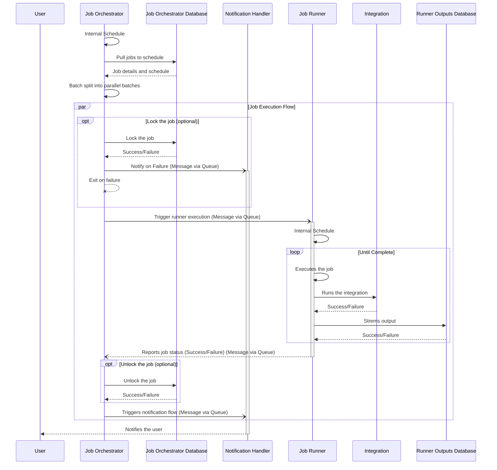

### Conceptual Sequence Diagram for UC2.1

```mermaid
sequenceDiagram
    participant User as User
    participant Orchestrator as Job Orchestrator
    participant OrchestratorDatabase as Job Orchestrator Database
    participant Notification as Notification Handler
    participant Runner as Job Runner
    participant Integration as Integration
    participant RunnerOutputs as Runner Outputs Database

    %% Job Orchestrator executes the job
    Orchestrator->>Orchestrator: Internal Schedule
    Orchestrator->>OrchestratorDatabase: Pull jobs to schedule
    OrchestratorDatabase-->>Orchestrator: Job details and schedule
    Orchestrator->>Orchestrator: Batch split into parallel batches
    par Job Execution Flow
        opt Lock the job (optional)
            Orchestrator->>OrchestratorDatabase: Lock the job
            OrchestratorDatabase-->>Orchestrator: Success/Failure
            Orchestrator-)+Notification: Notify on Failure (Message via Queue)
            Orchestrator--XOrchestrator: Exit on failure
        end
        Orchestrator-)+Runner: Trigger runner execution (Message via Queue)
        Runner->>Runner: Internal Schedule
        loop Until Complete
            Runner->>Runner: Executes the job
            Runner->>Integration: Runs the integration
            Integration-->>Runner: Success/Failure
            Runner->>RunnerOutputs: Strems output
            RunnerOutputs-->>Runner: Success/Failure
        end
        Runner--)-Orchestrator: Reports job status (Success/Failure) (Message via Queue)
        opt Unlock the job (optional)
            Orchestrator->>OrchestratorDatabase: Unlock the job
            OrchestratorDatabase-->>Orchestrator: Success/Failure
        end

        %% Job Orchestrator notifies the user
        Orchestrator-)Notification: Triggers notification flow (Message via Queue)
    end
    Notification-->>-User: Notifies the user
```